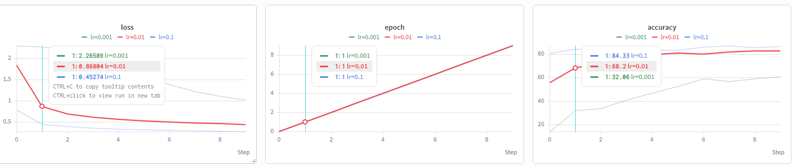

# FashionMNIST MLP — Custom Training Pipeline

A simple multilayer perceptron (MLP) trained from scratch on FashionMNIST using PyTorch, 
built to practice the full deep learning training pipeline without relying on high-level 
frameworks like PyTorch Lightning.

## What's implemented

- Data loading via `torchvision.datasets.FashionMNIST`, wrapped in a `DataLoader` for batching and shuffling
- A custom MLP defined as an `nn.Module` (784 → 128 → 128 → 128 → 10, ReLU activations, raw logits output)
- A full training loop written from scratch: `forward → loss → backward → step → zero_grad`
- Model evaluation on the test set (accuracy computed under `torch.no_grad()`)
- Experiment tracking with [Weights & Biases](https://wandb.ai) — logged loss and accuracy per epoch

## Results

Final test accuracy: **83.25%** (SGD, lr=0.1, 10 epochs)

### Learning rate comparison

Three learning rates were compared using W&B (`lr=0.1`, `lr=0.01`, `lr=0.001`):

`lr=0.1` converged fastest and reached the highest accuracy without oscillating. 
`lr=0.001` was too slow to converge within 10 epochs — its loss curve was still 
decreasing when training stopped.

## Tech stack

- PyTorch, torchvision
- Weights & Biases (experiment tracking)

## Status

🚧 In progress — next steps: regularization experiments (dropout, weight decay), 
refactoring into a standalone `train.py` script with CLI arguments.